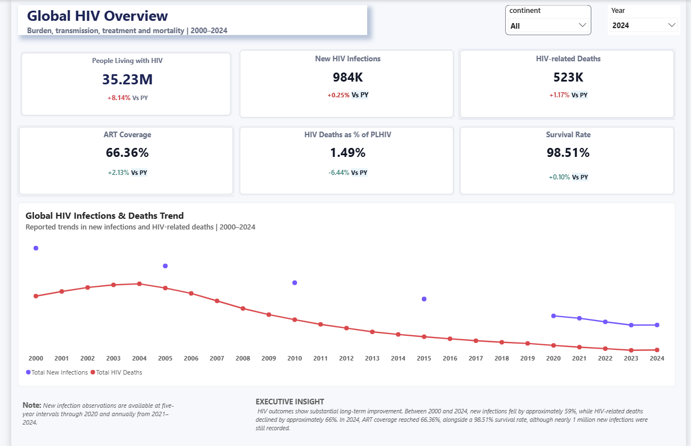

# Global HIV Analytics — Public Health Intelligence

A Power BI case study analysing long-term global HIV burden, mortality and treatment progress from **2000 to 2024**.

[View the full portfolio case study](https://mayfuns.github.io/mariam-analytics-portfolio/global-hiv.html)



## Dashboard pages

The Power BI report contains three pages:

1. [Global HIV Overview](01_dashboard/global-hiv-overview.png)
2. [Geographic HIV Burden](01_dashboard/global-hiv-geographic-burden.png)
3. [Treatment Access & HIV Outcomes](01_dashboard/global-hiv-treatment-outcomes.png)

Each page can also be viewed directly through the portfolio's dashboard gallery.

## Project overview

This project was designed to make long-term global HIV trends easier to understand and to show how the burden of disease has changed over time.

The analysis brings together infections, HIV-related deaths, people living with HIV and treatment coverage so progress can be interpreted in context rather than through a single headline metric.

## Public-health question

**How have new HIV infections, HIV-related deaths, treatment coverage and the number of people living with HIV changed between 2000 and 2024?**

## Tools and skills

- Power BI
- DAX
- Power Query
- Public health analytics
- Trend analysis
- Time-series comparison
- KPI design
- Data validation
- Dashboard design
- Data storytelling

## Analysis areas

### New HIV infections
Long-term change in annual new infections and the scale of reduction over time.

### HIV-related deaths
Trend analysis showing how mortality associated with HIV changed across the reporting period.

### People living with HIV
Disease-burden context showing the scale of the population living with HIV alongside treatment and outcome measures.

### Treatment coverage
ART coverage and related indicators used to understand progress in access to treatment.

## Key findings

| Measure | Result | Interpretation |
| --- | ---: | --- |
| New HIV infections | **−59.02%** | New infections declined substantially between 2000 and 2024. |
| HIV-related deaths | **−65.50%** | Mortality associated with HIV fell markedly over the same period. |
| Analysis period | **2000–2024** | A 25-year view of global HIV burden and treatment progress. |
| Analytical focus | **Global** | Burden, mortality, treatment and long-term trends are reviewed together. |

The long-term direction shows substantial improvement in major burden and mortality indicators. However, progress is most meaningful when infections and deaths are interpreted alongside treatment access and the continuing population living with HIV.

## Analytical workflow

1. **Prepare and validate**  
   Structured and checked public-health indicators for consistency before analysis.

2. **Structure the indicators**  
   Organised measures around infection, mortality, disease burden and treatment.

3. **Build trend measures**  
   Used Power BI and DAX to create reusable indicators and time-based comparisons.

4. **Communicate public-health progress**  
   Designed an interactive reporting view that allows multiple HIV indicators to be interpreted together.

## Decision-support perspective

The dashboard is designed to support public-health interpretation rather than simply display historical figures.

Declines in new infections and deaths are important signals of progress, but they are more useful when reviewed alongside:

- Treatment coverage.
- The number of people living with HIV.
- Long-term changes in disease burden.
- Differences between outcome measures.

This combined view helps users evaluate progress without treating one metric as the complete story.

## What this project demonstrates

- Long-term trend analysis across a 25-year period.
- Translating public-health indicators into clear analytical measures.
- Using Power BI, DAX and Power Query for structured reporting.
- Bringing burden, mortality and treatment measures into one analytical view.
- Communicating population-health trends in a decision-support format.

## Portfolio

This project is part of my Data & BI Analytics portfolio.

- [Portfolio homepage](https://mayfuns.github.io/mariam-analytics-portfolio/)
- [Global HIV full case study](https://mayfuns.github.io/mariam-analytics-portfolio/global-hiv.html)
- [GitHub profile](https://github.com/Mayfuns)

---

**Mariam Adetoyi**  
Data Analyst | Business Intelligence | Public Health Analytics


## Repository structure

```text
01_dashboard/
  ├── Dashboard exports and screenshots
  └── README.md

02_powerbi/
  ├── Power BI project file (.pbix)
  ├── DAX measures / model notes
  └── README.md

03_data/
  ├── Source and cleaned analytical data
  ├── Data dictionary
  └── README.md

04_documentation/
  ├── Project report / methodology
  └── README.md
```

The repository is organised so the complete analytical workflow can be reviewed directly on GitHub rather than relying on external Drive links.
